# COVIDERS :boom:
***
## Motivation :brain:
This project was created to inform about all the data related to COVID-19 from around the world since it started until today.

## Build status :page_facing_up:

## Screenshots :desktop_computer:
### This is the Covider's Logo

### These are the page views:

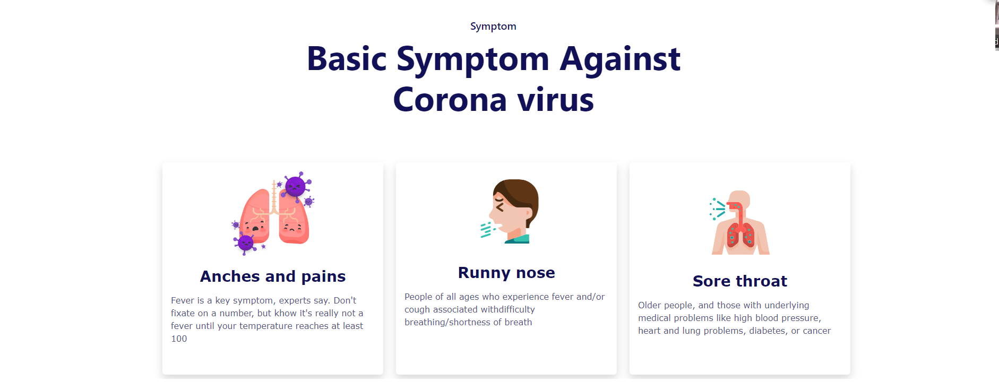
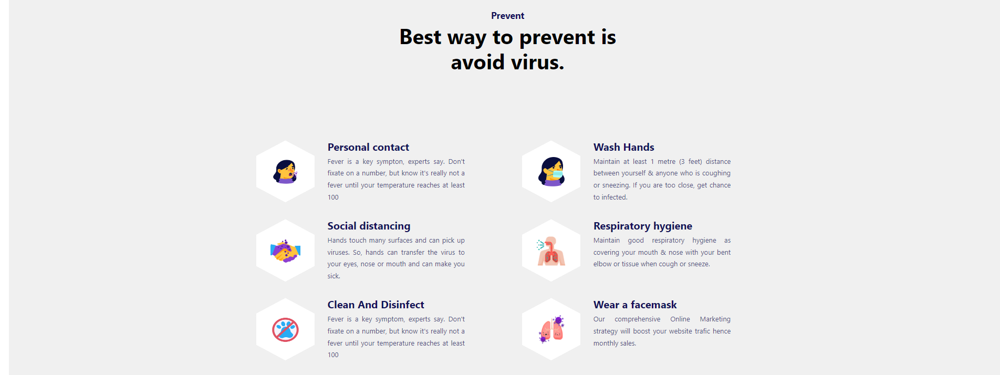
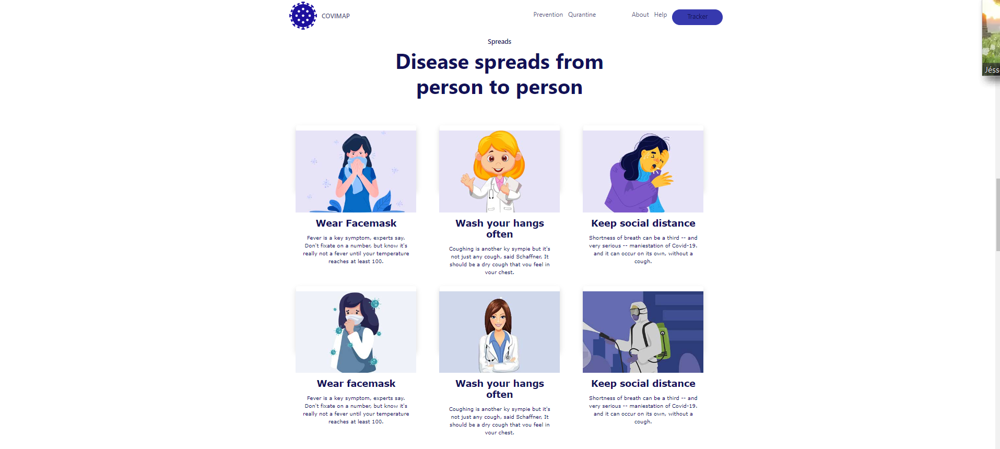
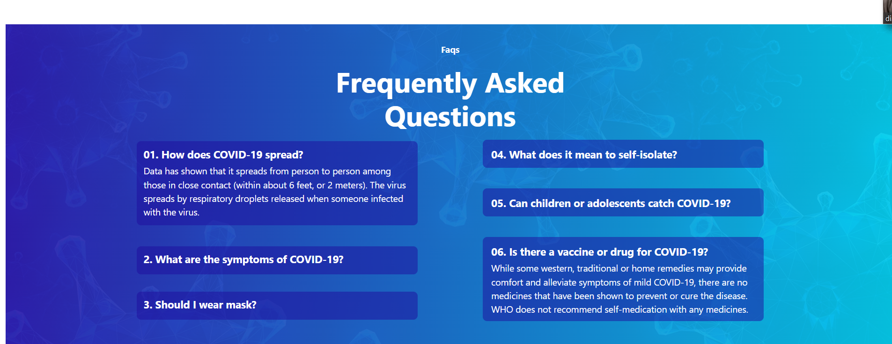
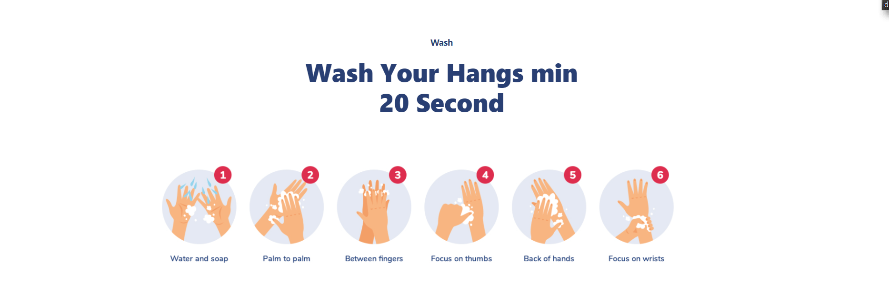
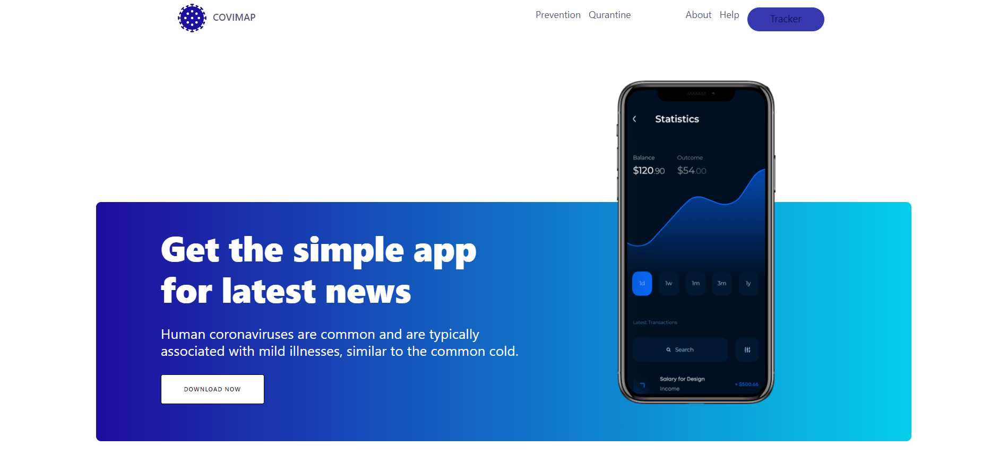
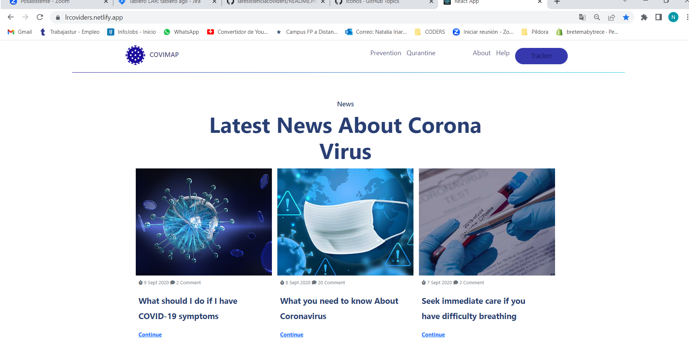
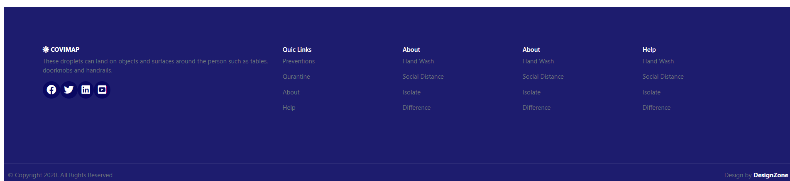
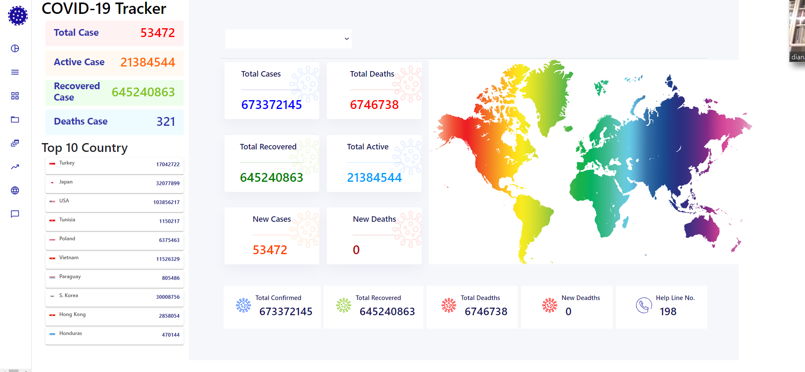
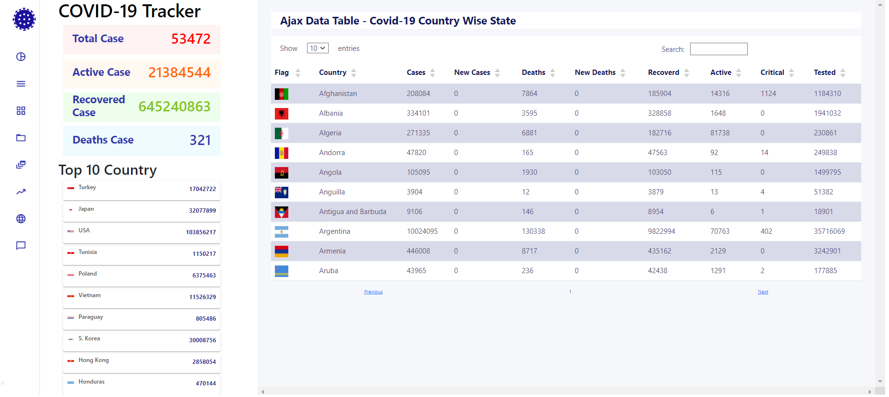

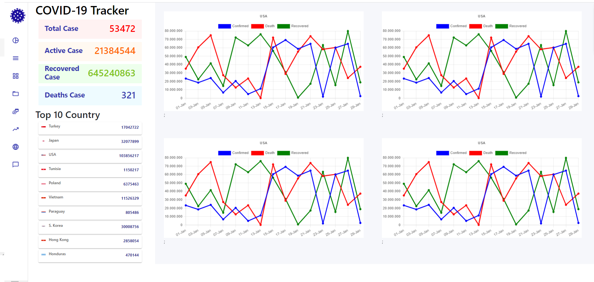
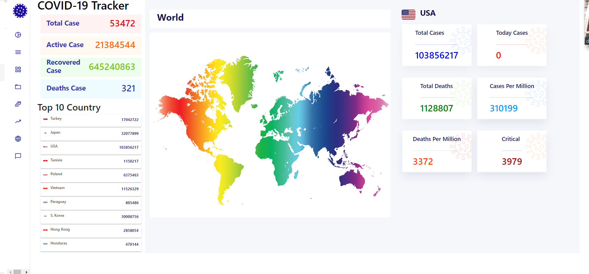

## Tech/framework used :electric_plug:
* **HTML** - utilizado para crear la estructura básica de la página web
* **CSS** - utilizado para estilizar la interfaz de usuario
* **JavaScript**- utilizado para el desarrollo de página web
* **npm** - utilizado para manejar las dependencias

## Technology stack :gear:
* Bootstrap: 5.2.3 [Sitio web oficial](https://getbootstrap.com/)
* Mui/material: 5.11.4 [Sitio web oficial](https://mui.com/)
* React: 18.2.0 [Sitio web oficial](https://es.reactjs.org/)
* Chart.js: 4.1.2 [Sitio web oficial](https://www.chartjs.org/)
* Prop-types: 15.8.1 [Sitio web oficial](https://www.npmjs.com/package/prop-types)

## Installation :mechanic:
* Create a directory on your computer to store the project
* Run ***$ git clone https://github.com/JessRm04/laresistenciacoviders***

## API Reference 👩‍💻
Click [here](https://disease.sh) 

## How to use? :key:
* First, in te project directory run ***$ npm install***
* Then, in the project directory run ***$ npm start***

## Contributors :family_woman_woman_girl_girl:
* [Diana Borrajo](https://github.com/Dianab177) Scrum Master and Developer
* [Sharon Infante](https://github.com/SharonInfante) Developer
* [Natalia Iriarte](https://github.com/Natalia-irlo) Product Owner and Developer
* [Jéssica Ríos](https://github.com/JessRm04) Developer
* [Aida Sousa](https://github.com/AidaSousa) Developer

## License :closed_lock_with_key:
© [COVIDERS](https://lrcoviders.netlify.app/)
