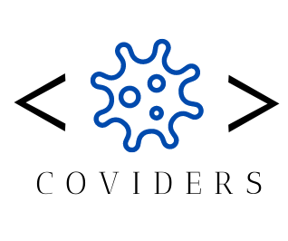

# COVIDERS :boom:
***
## Motivation :brain:

## Build status :page_facing_up:
## Code style :keyboard:
## Screenshots :desktop_computer:

## Tech/framework used :electric_plug:
## Code Example :eye_speech_bubble:
## Installation :mechanic:
- Create a directory on your computer to store the project
- Run ***$ git clone https://github.com/JessRm04/laresistenciacoviders***
- In the project directory run ***$ npm start***

## API Reference 👩‍💻
Click [here](https://disease.sh) 

## Tests 📝
## How to use? :key:
## Contributors :family_woman_woman_girl_girl:
* [Diana Borrajo](https://github.com/Dianab177)
* [Sharon Infante](https://github.com/SharonInfante)
* [Natalia Iriarte](https://github.com/Natalia-irlo)
* [Jéssica Ríos](https://github.com/JessRm04)
* [Aida Sousa](https://github.com/AidaSousa)
## Credits 📌
## License :closed_lock_with_key:
